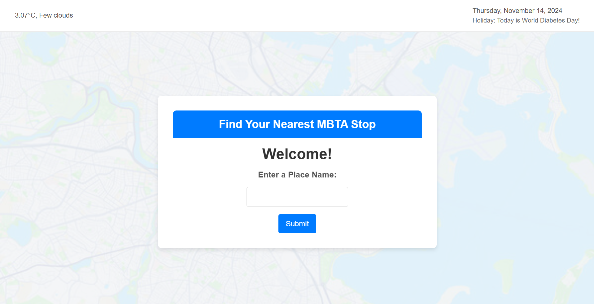
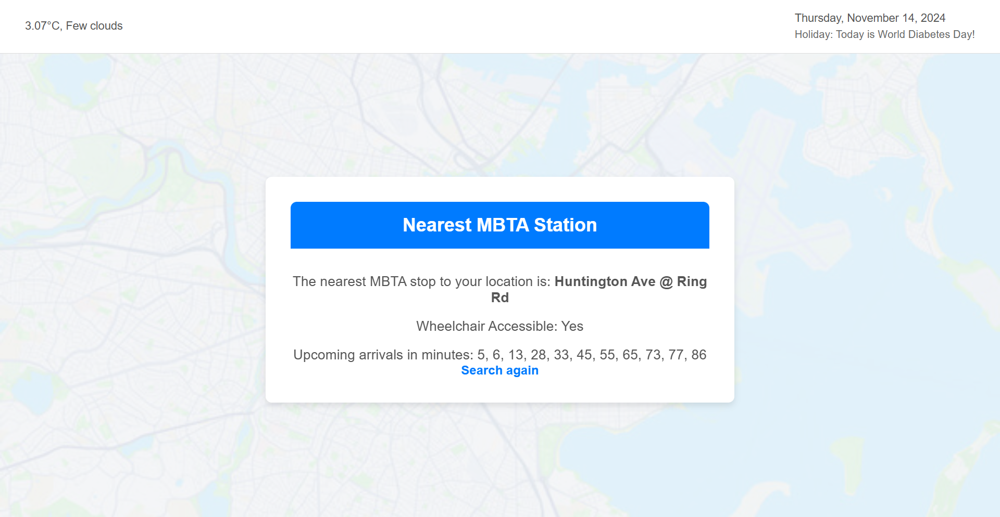

# MBTA Nearest Stop Finder

## Project Overview

This project is a Flask web application that allows users to find the nearest MBTA (Massachusetts Bay Transportation Authority) stop to a given location. The main objectives were to utilize APIs to get location, transportation, weather, and holiday data and present it in an organized, user-friendly web interface. Users can enter a place name, and the app fetches the coordinates using the Mapbox Geocoding API. It then finds the closest MBTA station with details on wheelchair accessibility and real-time arrival predictions using the MBTA API. Additionally, the app features a live weather display using the OpenWeather API, the current date, and information on whether today is a public holiday (using the Abstract Holidays API).

The app includes several extensions beyond the basic requirements, such as a responsive layout, a visually enhanced UI with background images, and a header displaying live date, weather, and holiday information. Error handling is also built-in to guide users back to the home page if an issue occurs.

## Reflection

### Development Process

Developing this project involved setting up a Flask application with multiple API integrations, each bringing unique challenges. API requests for real-time data (weather, MBTA station arrival times, and holidays) worked well once proper error handling was implemented. It required multiple steps to ensure all dependencies and environment variables (API keys) were correctly set up. Debugging was key, especially in ensuring API calls returned valid data and handling HTTP errors like "Too Many Requests." Given the rate limitations of some APIs, caching and API usage optimization could be further improved to enhance app efficiency.

The biggest challenges included testing and debugging each API individually and handling scenarios when certain data (like holiday information) was unavailable. Testing with various inputs, including edge cases like invalid locations or days without holidays, helped refine the error handling. Some extensions, like the weather and holiday display, required more API requests, which had to be managed carefully to avoid rate limiting. In the future, additional caching or reducing redundant API calls could be beneficial for performance.

### Lessons Learned and Reflections

This project taught me about working with multiple APIs in a single project and effectively managing data retrieved from different sources. Understanding JSON response structures and handling different HTTP errors became key parts of the process. Integrating AI tools like ChatGPT was a huge help in brainstorming solutions to debugging issues and optimizing code—especially with API integration and error handling. I realized the importance of reading and understanding API documentation thoroughly to avoid unnecessary requests. Knowing about potential rate limits earlier would have helped me design around them more effectively.

This project strengthened my knowledge of web development, API integration, and real-time data processing. The challenges in testing and debugging were valuable learning points, and I plan to apply this knowledge to similar projects in the future. Working with AI tools improved my efficiency, particularly in understanding error messages and refining my code. Below are some screenshots showing key development stages and final project features:

### Screenshots

*The home page with an input form for location and header with date, weather, and holiday data.*

*Displaying the nearest MBTA stop with real-time arrival information.*

## Technologies Used

- Python, Flask
- HTML, CSS
- APIs: Mapbox Geocoding, MBTA, OpenWeather, Abstract Holidays

